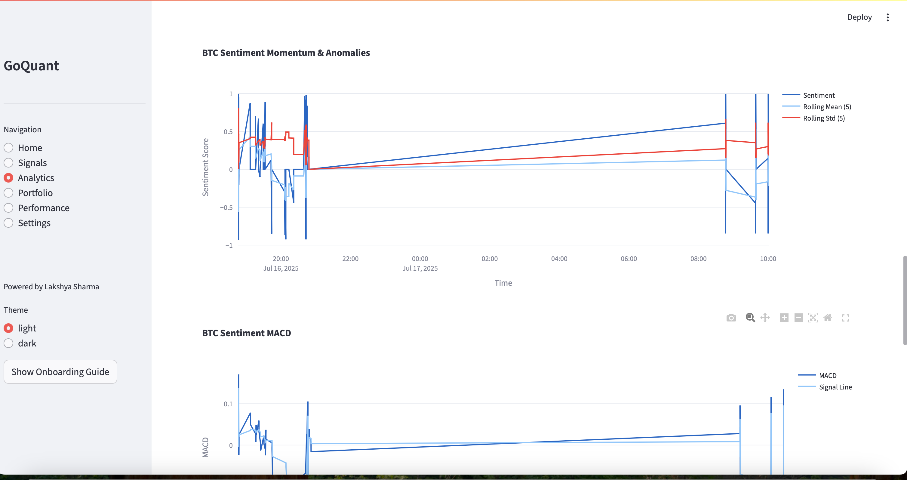

# 🚀 GoQuant Fear & Greed Sentiment Engine

## Overview

The **Fear & Greed Sentiment Engine** is a real-time, high-performance backend system that ingests multi-source financial and social data (Twitter, Reddit, news feeds, financial APIs), performs sentiment analysis, correlates sentiment with market movements, and generates actionable trade signals based on market psychology (fear & greed indicators).

Designed to be modular, extensible, and optimized for low-latency environments, the engine powers sentiment-based trading and market insights.

---

## �� Table of Contents
- [Architecture](#-architecture)
- [Implemented Features](#-implemented-features)
- [Planned & Advanced Features](#-planned--advanced-features)
- [System Modules](#-system-modules)
- [Data Flow Pipeline](#-data-flow--pipeline)
- [Dashboard & Analytics](#-dashboard--analytics)
- [Sample Dashboard Screenshots](#-sample-dashboard-screenshots)
- [Configuration & Setup](#-configuration--setup)
- [Usage](#-usage)
- [API & Module Examples](#-api--module-usage-examples)
- [Testing](#-testing)
- [Known Issues & Limitations](#-known-issues--limitations)
- [Future Improvements](#-future-improvements)
- [Submission Checklist](#-submission-checklist)
- [Contact & License](#-contact--license)
- [Confidentiality Notice](#-confidentiality-notice)
- [Author](#author)


---

## 🏗️ Architecture


---

## ✅ Implemented Features
- Real-time ingestion from Twitter (mock/live), Reddit, news feeds, financial data, fund flows, and economic indicators
- NLP using VADER (default), spaCy NER, and optional FinBERT/OpenAI (if enabled)
- Financial entity recognition and tagging
- Weighted, time-decayed, and rolling sentiment aggregation (asset-specific and market-wide)
- Fear & Greed index calculation (market-wide and per-asset)
- Confidence-based signal generation with:
  - Entry/exit points
  - Position sizing
  - Risk adjustments
  - Expected holding duration
- Linear regression-based predictive modeling
- Backend-only backtesting system with historical data
- Real-time visualization via Streamlit & matplotlib
- Portfolio-level risk metrics and monitoring
- Modular codebase with proper separation of concerns
- Unit tests for core logic

---

## 🧪 Planned & Advanced Features
- Sarcasm/irony detection (currently a placeholder)
- Transformer-based deep learning models (e.g., FinBERT variants, OpenAI GPT)
- Multilingual sentiment analysis (planned)
- Crowd psychology and behavioral bias analytics (planned)
- Integration of alternative data (satellite, earnings calls, filings)
- Performance optimizations: GPU acceleration, lock-free data structures
- Advanced analytics: cross-asset contagion, regime detection, ensemble modeling

---

## 🧩 System Modules
- `ingestion/`: Twitter, Reddit, News, Financial, Economic data handlers (each in its own thread)
- `nlp/`: Text preprocessing, tagging, and sentiment scoring (VADER, spaCy, FinBERT, OpenAI)
- `sentiment_engine/`: Aggregator, processor, analytics (trend detection, correlation, contagion)
- `signal_engine/`: Signal logic and generation (confidence, risk, position sizing)
- `risk/`: Risk metrics and portfolio simulation
- `visualization.py`, `streamlit_dashboard.py`: Dashboards and visual output (multi-tabbed, interactive)
- `backtesting.py`: Historical signal evaluation (backend only)
- `predictive_model.py`: Price movement forecasting (linear regression)
- `utils/`: Utility scripts, tagging helpers
- `tests/`: Unit tests for core logic

---

## 🔄 Data Flow & Pipeline
1. **Ingestion:** Streams or fetches data from real-time APIs or local mock datasets
2. **NLP & Tagging:** Cleans, normalizes, and tags financial text data; supports multiple models
3. **Sentiment Aggregation:** Computes rolling, weighted, and time-decayed sentiment scores (asset and market-wide)
4. **Analytics:** Detects sentiment trends, correlations, contagion effects, and predictive modeling
5. **Signal Generation:** Generates trade signals with scoring, risk adjustments, and position sizing
6. **Risk Monitoring:** Simulates and evaluates portfolio exposure
7. **Visualization:** Real-time insights and dashboards (Streamlit, matplotlib)
8. **Backtesting (Backend Only):** Evaluates strategies on historical data

---

## 📊 Dashboard & Analytics
- **Streamlit Dashboard:** Multi-tabbed interface (Home, Signals, Analytics, Portfolio, Performance, Settings, and advanced features)
- **Features:**
  - Real-time and historical sentiment analytics
  - Asset-specific and market-wide sentiment breakdowns
  - Trade signal lists with confidence, risk, and position sizing
  - Portfolio risk metrics and performance tracking
  - Interactive charts, gauges, and search/filter tools
  - Advanced tabs for future features (transformer sentiment, sarcasm detection, price prediction, contagion, behavioral bias, alpha/backtest)
  - Light/dark mode, onboarding guide, and data download

---
### 📸 Sample Dashboard Screenshots

#### 1. OnBoarding Guide


#### 2. Home Page
<p align="center">
  
  
  
</p>

#### 3. Signals 


#### 4. Analytics
<p align="center">
  
  
  
  
  
  
</p>

#### 5. Portfolio Performance
<p align="center">
 
  
  
</p>

#### 6. Performance
<p align="center">
 
  
  
</p>

## ⚙️ Configuration & Setup
1. **Configure:** Edit `config.py` with API keys, toggles, assets, and parameters
2. **Install dependencies:**
   ```bash
   pip install -r requirements.txt
   ```
3. **Optional installations:**
   ```bash
   pip install scikit-learn streamlit jupyter
   ```

---

## 🖥️ Usage
1. **Run the engine:**
   ```bash
   python main.py
   ```
2. **Run demo notebook:**
   ```bash
   jupyter notebook demo.ipynb
   ```
3. **Launch dashboard (Streamlit):**
   ```bash
   streamlit run streamlit_dashboard.py
   ```

---

## 🔌 API & Module Usage Examples
```python
# Generate trade signals
from signal_engine.generator import generate_signals
signals = generate_signals()

# Aggregate sentiment scores
from sentiment_engine.aggregator import compute_scores
scores = compute_scores()

# Backtest strategies (backend only)
import backtesting
report = backtesting.backtest_signals(asset="BTC")

# Risk metrics
from risk.portfolio import get_portfolio_risk
risk = get_portfolio_risk()
```

---

## 🧪 Testing
Run all tests:
```bash
pytest tests/
```
All modules include inline comments, type hints, and are designed for testability.

---

## ⚠️ Known Issues & Limitations
- Sarcasm detection is rudimentary (placeholder logic)
- Deep learning models not integrated by default
- Multi-language NLP not yet implemented
- Some APIs may require free-tier or personal API keys
- Streamlit dashboard does **not** include backtesting (backend only)
- Not yet optimized for ultra-high-frequency or sub-100ms latency

---

## 🔮 Future Improvements
- Integrate real sarcasm detection and sentiment shifters
- Add FinBERT/Transformer-based inference pipeline
- Incorporate behavioral biases and crowd psychology models
- Support additional asset classes and alt-data streams
- GPU and performance optimizations for large-scale use
- Expand dashboard analytics and backtesting visualization

---

## 📋 Submission Checklist
- ✅ Source code with documentation
- ✅ Streamlit dashboard + backend modules
- ✅ Unit tests for core modules
- ✅ Demo notebook (`demo.ipynb`)
- ✅ Video demonstration
- ✅ Resume attached
- ✅ Subject line: `Back End - Fear & Greed Sentiment Engine`

---

## 📬 Contact & License
- **Author**: Lakshya Sharma  
- **Email**: sharmalakshya107@gmail.com  
- **License**: Proprietary – for GoQuant recruitment evaluation only. Not for public distribution.

---

## 🛡️ Confidentiality Notice
This project and associated code are submitted exclusively for GoQuant recruitment. Do not share, publish, or post any content publicly (including GitHub, YouTube, etc.).

---

## 👨‍💻 Author
Developed by **Lakshya Sharma**  
**Role**: Backend Engineer Candidate – GoQuant Sentiment Engine Project  
